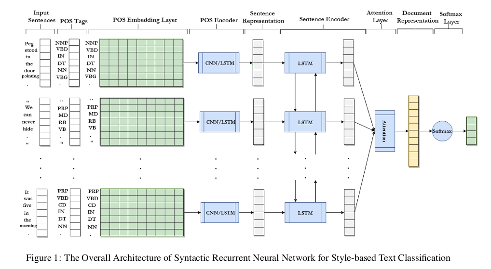
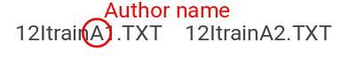
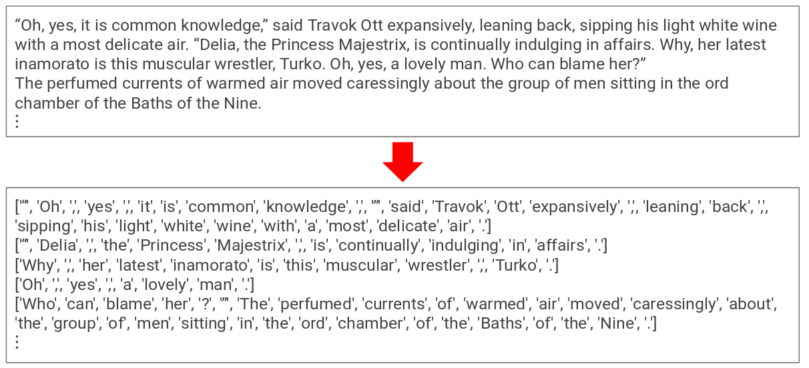
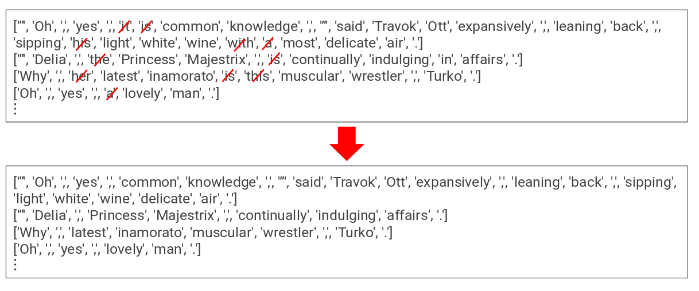
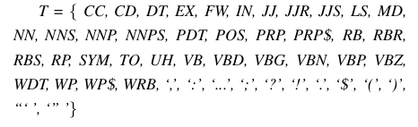
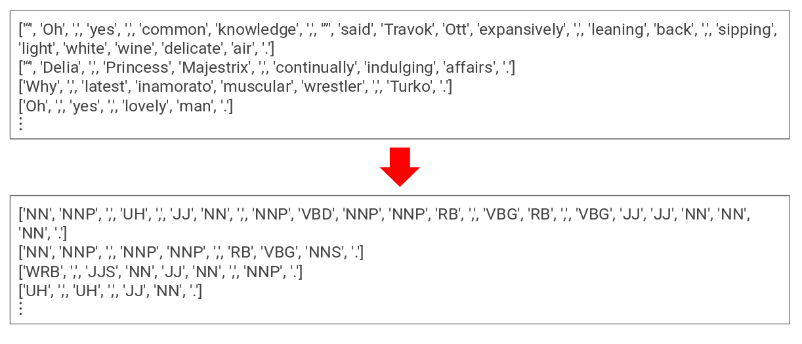
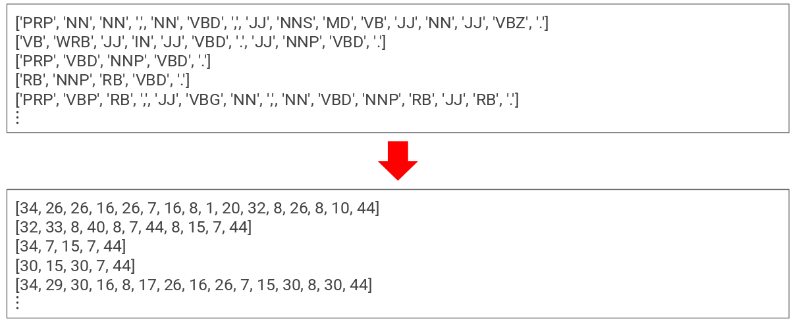
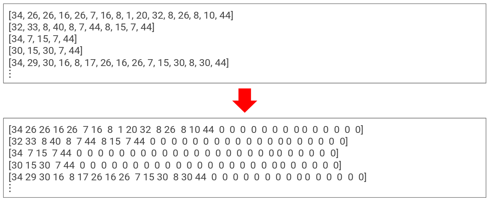

# Syntactic Recurrent Neural Network for Authorship Attribution
By : Danish Mukhtar ( M.Tech IIIT Hyderabad)
<!-- vim-markdown-toc -->

## Introduction

We introduce a syntactic recurrent neural network to encode the syn-
tactic patterns of a document in a hierarchical structure. First, we
represent each sentence as a sequence of POS tags and each POS tag
is embedded into a low dimensional vector and a POS encoder (which
can be a CNN or LSTM) learns the syntactic representation of sen-
tences. Subsequently, the learned sentence representations aggregate
into the document representation. Moreover, we use attention mecha-
nism to reward the sentences which contribute more to the prediction
of labels. Afterwards we use a soft-max classifier to compute the prob-ability distribution over class labels.
The overall architecture of the network is

</img>

## Dataset :
We used Pan 2012 dataset URL : https://pan.webis.de/data.html . The Given DataSet (Novels and their Writers)is of the form of text
files.
The name of these Text files are as follows-
12ItrainA1.TXT,
12ItrainB2.TXT,
12ItrainD2.TXT,
12ItrainF2.TXT,
12ItrainH2.TXT,
12ItrainJ2.TXT,
12ItrainL1.TXT,
12ItrainM2.TXT,
12ItrainN3.TXT,
12ItrainA2.TXT,
12ItrainC1.TXT,
12ItrainE1.TXT,
12ItrainG1.TXT,
12ItrainI1.TXT,
12ItrainK1.TXT,
12ItrainL2.TXT,
12ItrainM3.TXT,
12ItrainA3.TXT,
12ItrainB1.TXT,
12ItrainC2.TXT,
12ItrainD1.TXT,
12ItrainE2.TXT,
12ItrainF1.TXT,
12ItrainG2.TXT,
12ItrainH1.TXT,
12ItrainI2.TXT,
12ItrainJ1.TXT,
12ItrainK2.TXT,
12ItrainK3.TXT,
12ItrainL3.TXT,
12ItrainM1.TXT,
12ItrainN1.TXT,
12ItrainN2.TXT

Such that the name of the Authors are after the keyword ’train’ and
then after the name of the author the number which is to differentiate
between different novels of the same author.

</img>

## POS Embedding
We assume that each document is a sequence of M sentences and
each sentence is a sequence of N words, where M , and N are model
hyper parameters.Given a sentence, we convert each word into the
corresponding POS tag in the sentence and afterwards we embed each
POS tag into a low dimensional vector P,using a trainable lookup
table.

### Loading Novels and Removing Stop words 
The model first takes the Dataset, Reads it and converts all the words
to token.
As shown below-
</img>

There are certain words which are useless as tokens to aur models and
are very frequent in the novels,they do not make any difference and
does not even tell the style of the author.Hence we need to remove
them.
</img>

### Words to POS tags and then to sequence number
For further processing of Data , we need to change every word to
part-of-speech tag.We use NLTK part-of-speech tagger for the tagging
purpose and use the set of 47 POS tags in our model as follows.
</img>
</img>

The POS tags has a numbers assigned to it. The tags generated are
converted to sequence number using this mapping.
</img>

Then, padding is added to each sentence to make them of the same
length.
</img>

### POS encoder 
POS encoder learns the syntactic representation of sentences from the
output of POS embedding layer. In order to investigate the effect of
short-term and long-term dependencies of POS tags in the sentence,
we exploit both CNNs and LSTMs.
####  Short-term Dependencies
CNNs generally capture the short-term dependencies of words in the
sentences which make them robust to the varying length of sentences
in the documents
####  Long-term Dependencies
Recurrent neural networks especially LSTMs are capable of capturing
the long-term relations in se- quences which make them more effec-
tive compared to the conventional n-gram models where increasing
the length of sequences results a sparse matrix representation of doc-
uments.

### Sentence encoder 
Sentence encoder learns the syntactic representation of a document
from the sequence of sentence representations outputted from the POS
encoder. We use a bidirectional LSTM To capture how sentences with
different syntactic patterns are structured in a document.

### Classification 
The learned vector representation of documents are fed into a soft-
max classifier to compute the probability distribution of class labels.
The model parameters are optimized to minimize the cross-entropy loss over all the documents in the training corpus.

## Experimental Results
We report both segment-level and document-level accuracy. As men-
tioned before, each document (novel) has been divided into the seg-
ments of 100 sentences. Therefore, each segment in a novel has classi-
fied independently and afterwards the label of each document is cal-
culated as the majority voting of its constituent segments.

Document level Accuracy for both LSTM-LSTM and CNN-
LSTM Model was 100% (14/14 novels)

#### Graph for Training and Validation Accuracy for LSTM-LSTM
</img>
The Validation Accuracy for LSTM-LSTM Model achieved
was 72%
#### Graph for Training and Validation Accuracy for CNN-LSTM
</img>
The Validation Accuracy for CNN-LSTM Model achieved
was 71%

## Hindi-Dataset Results
Apart from English novels and their writers, we also experimented us-
ing Hindi novel.
First, we Downloaded Hindi novels in the form of text files. Convert-
ing them to POS tags by using NLTK part-of-speech tagger for the
tagging purpose of type ’INDIAN’ and then after this passing the tags
through the LSTM-LSTM model the same way as english data set.
There is an abnormal behavior of Model for HIndi dataset,
As for the POS Tagging we used NLTK standard library but
for hindi one this is incomplete .Majority of times it assigns
UNK i.e., UNKNOWN POS TAG for the word.Hence finds
difficult to learn.

